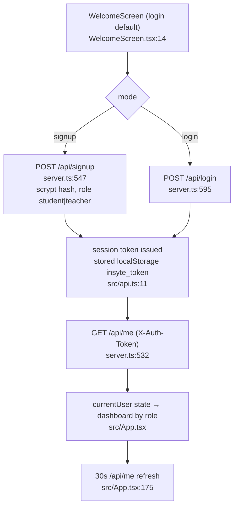

# Auth / login flow

Login = 3 fields total (email, password, submit), single screen, no redirect
chain — audit's "too many steps" finding already minimal; no change made.
Today: labels linked (htmlFor/id), contrast raised, single consistent CTA.
