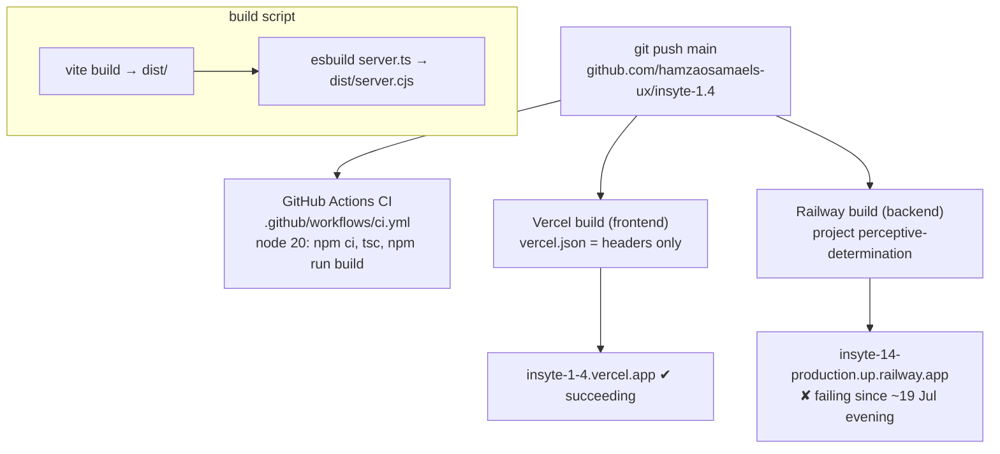

# Build & deploy flow

Evidence (2026-07-20):
- GitHub commit status on `0dfa908`: Vercel = success, Railway = failure.
- CI green on all recent commits (same npm ci + build on Linux).
- Clean-room repro (git archive → npm ci → npm run build) exits 0 locally.
- Favicon-only commit `0dfa908` also failed on Railway → failure is not code.
- Railway CLI on this machine is logged in as hamza.osama.els@gmail.com and
  cannot see the project (likely owned by insyte.startup@gmail.com workspace)
  → build logs unreachable from here; needs dashboard check (credits/plan/
  settings) by the owner.
