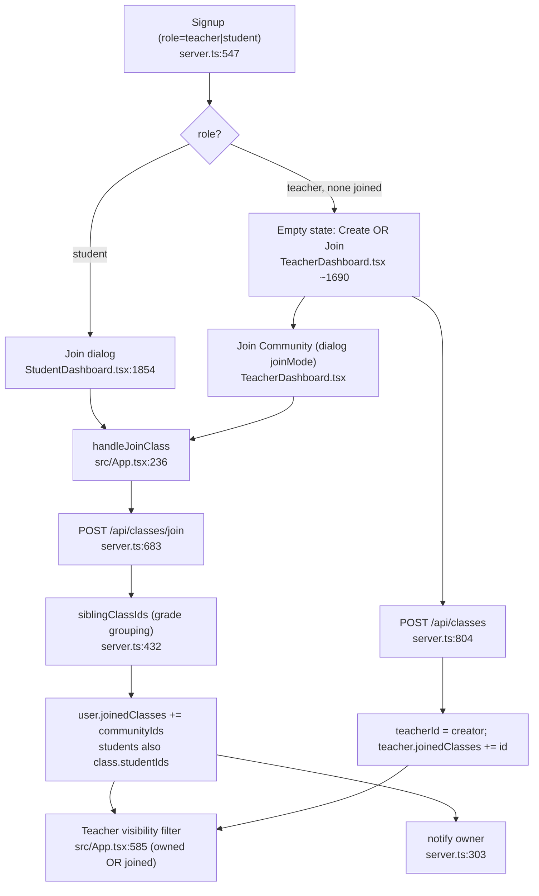

# Community membership flow

Invariants: `teacherId` = single owner, never changes on join (co-teacher =
membership via joinedClasses only). Student join adds to `studentIds`; teacher
join does not. Duplicate join → 409. Legacy `studentId` body key still accepted.
