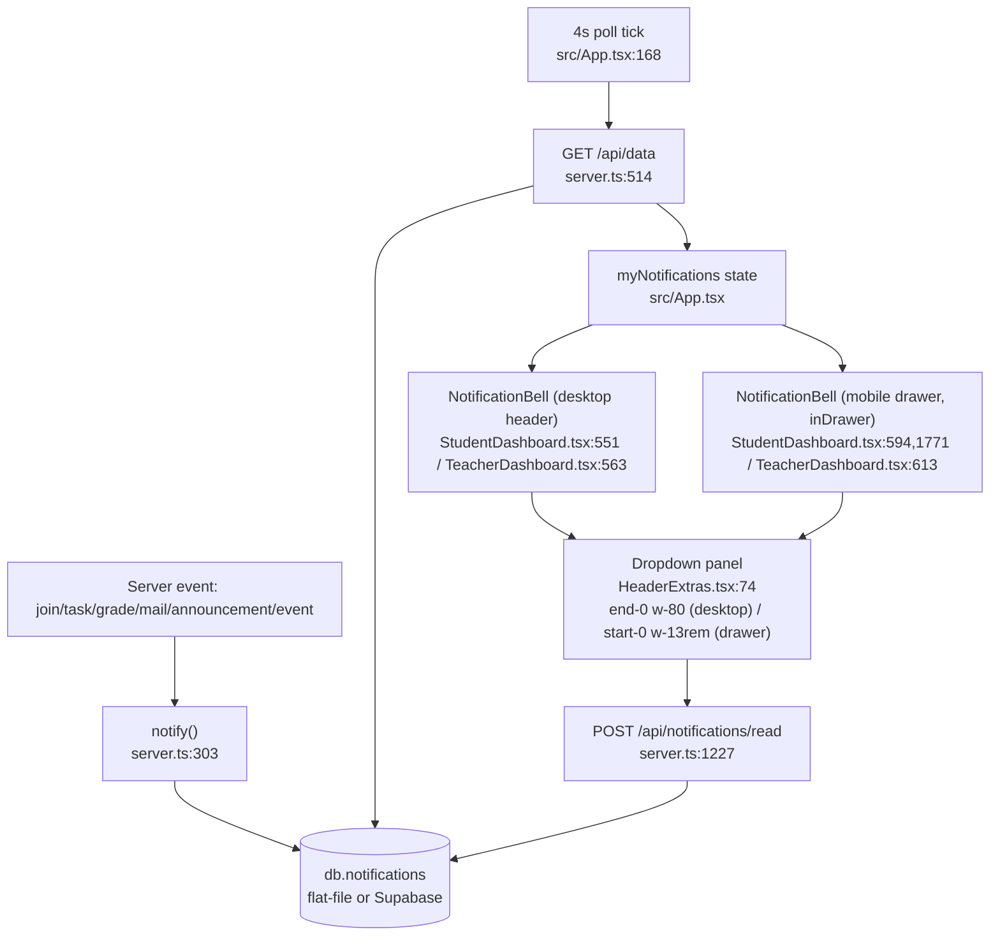

# Notifications flow

Side effects: db write on notify + mark-read. Browser Notification API (Settings
opt-in) mirrors new items client-side.

Fixed today: drawer instance rendered `end-0` (opens leftward) inside the
left-anchored, overflow-clipped `.mobile-drawer` (index.css:52) — panel was
invisible. Now `inDrawer` prop → `start-0 w-[13rem]`, logical properties keep
RTL correct (drawer flips to right edge under `[dir="rtl"]`, index.css:65).
